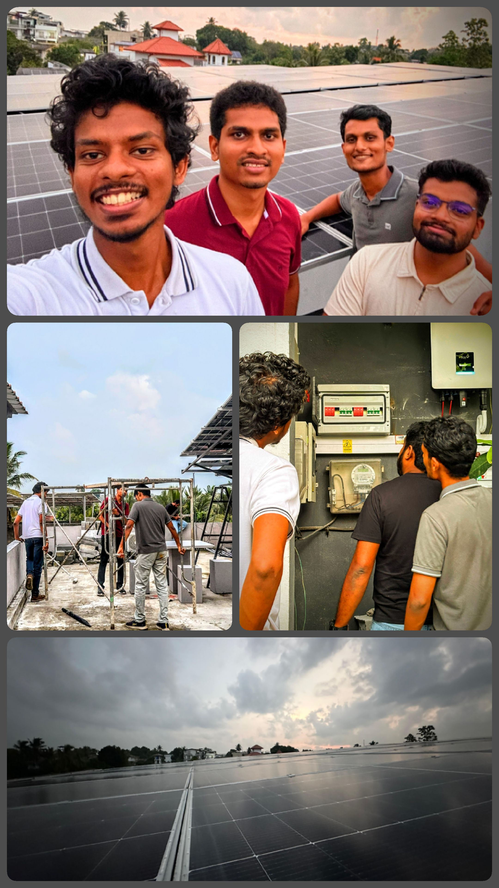

# ⚡ Smart Solar Inverter System (SEIAN)

A cutting-edge smart inverter system designed for integration into Smart Microgrids and the Smart National Grid. Our solution leverages IoT, advanced control systems, and machine learning to create an adaptive, fault-resilient energy platform.

## 📸 Project Snapshots

### 👨‍💻 Our Team

### 💡 Inverter - Product View

### 🔧 Inverter Internals
  

---

## 🚀 Overview

**SEIAN** (Smart Energy IoT-Aware Network) is a smart inverter designed to:

- Monitor the grid status in real-time
- Share operational data with a central server
- Perform autonomous grid fault detection and correction
- Support seamless connection to grid or microgrid environments

## 🧠 System Architecture

Our smart inverter system includes:

### 🎯 Local Inverter Node (SEIAN Unit)

- **AC Measurement Circuitry**:  
  - Measures voltage, current, frequency, power factor, harmonics, and phase.
- **Control Processor**:  
  - Calculates parameters and generates a synchronized sine wave for grid connection.
- **SPWM Control**:  
  - Sinusoidal Pulse Width Modulation (SPWM) via H-Bridge with 4 IGBTs and driver ICs.
- **Microcontroller**:  
  - Low-level registry-based control (to be upgraded to FPGA-based for optimization).
- **Communication Subsystem**:  
  - Overseen by a Raspberry Pi, communicates to central server via HTTP protocol.

### 🖥️ Central Server

- Collects real-time data from all SEIAN units
- Runs ML models to:
  - Detect faults (e.g., voltage sags, harmonic distortions)
  - Classify them using a neural network trained on historical/simulated grid data
  - Send corrective commands to inverter units (adjusting voltage, frequency, phase)

---

## 🛠 Current Status

✅ Inverter hardware prototype completed  
✅ Backend and database system integrated  
⚠️ PID feedback and filtering still under development  
⚠️ ML model in training phase  
⚠️ Cybersecurity layer in planning  
🔜 FPGA-based control and optimization in development

---

## 📍 Future Work

- Upgrade microcontroller-based control to an FPGA for faster and more reliable SPWM signal generation.
- Improve PID control stability and filtering.
- Complete cybersecurity and encryption layers for safe communication.
- Finalize and deploy ML model to live test environments.

---

## 📫 Contact

Dyson Sphare  -  Project Lead: **Rusula Oshadha**  
Electronics and Telecommunication Engineering, University of Moratuwa  
**Linkedin: ** [(https://www.linkedin.com/in/oshadhapathirana/)]

---

